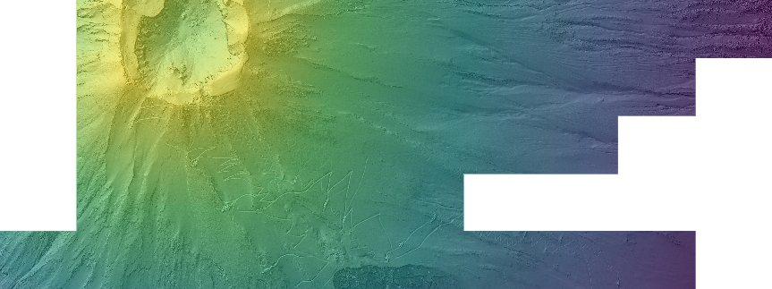
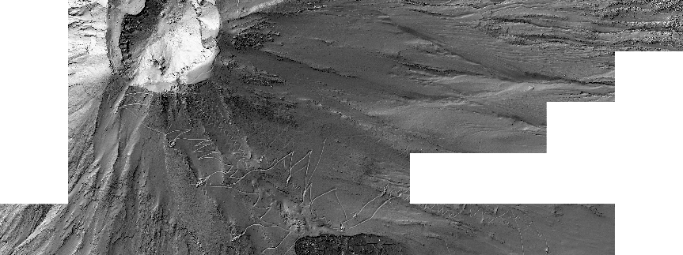
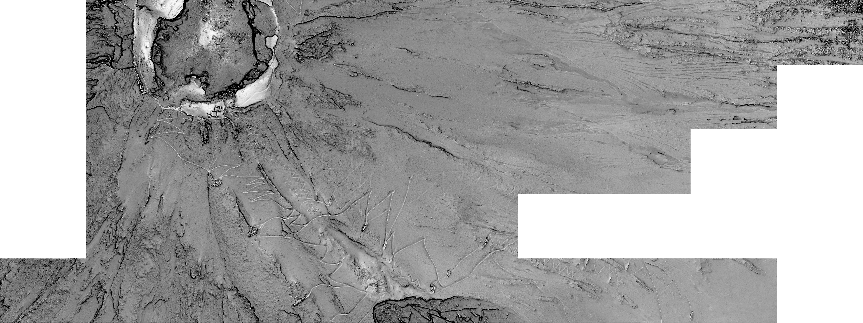
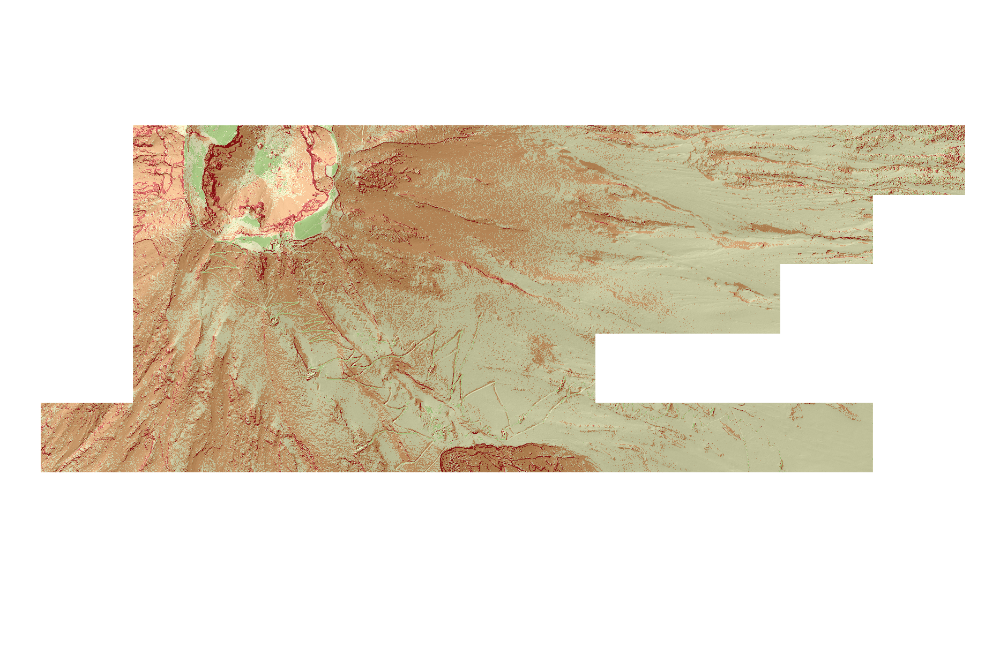
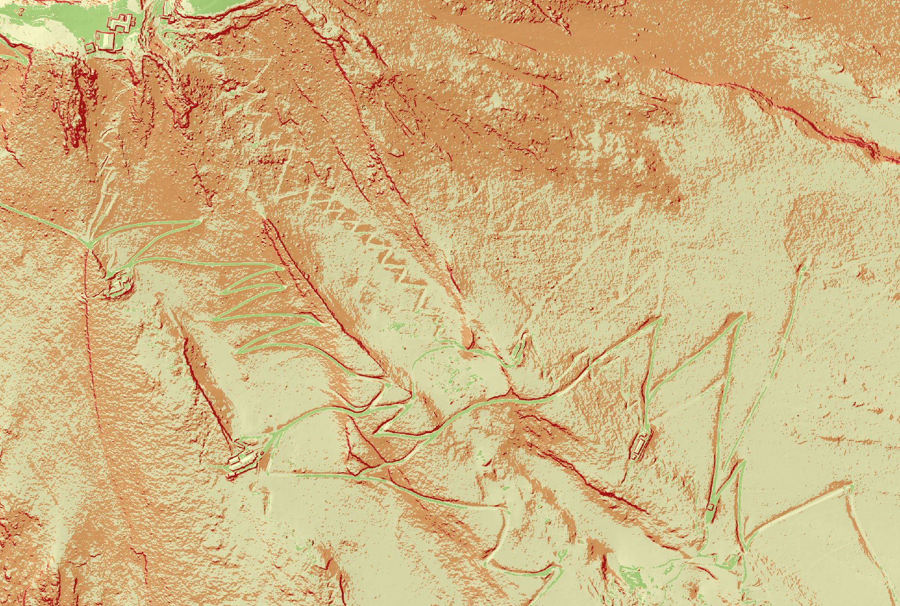

# Mt. Fuji LiDAR Terrain Analysis

Terrain analysis of Mt. Fuji's summit area using open airborne LiDAR data.

## Data

- VIRTUAL SHIZUOKA ground LiDAR (2021), 38 tiles
- Downloaded from the public AWS bucket `s3://virtual-shizuoka/2021/LP/Ground/08/ME/35/`
- Coordinate system: EPSG:6676 (JGD2011 / Japan Plane Rectangular CS VIII)

Raw data is not included because of its size.

Data credit: VIRTUAL SHIZUOKA point cloud data (c) Shizuoka Prefecture, licensed under [CC BY 4.0](https://creativecommons.org/licenses/by/4.0/). Processed for this project.

## What I did (QGIS)

1. Assigned the coordinate system to all tiles
2. Combined the tiles into one virtual point cloud
3. Created a 0.5 m terrain model (DTM)
4. Made a hillshade, sky-view factor and slope map

## Results

| Hillshade | Sky-view factor |
|---|---|
|  |  |

### Slope

Green: gentle (0-15 degrees), yellow: 15-30, orange: 30-45, red: steep (over 45).
Most of the upper slope is 30-45 degrees, and the steepest areas are the crater walls and gully sides.

### Trails close-up

At 0.5 m resolution, the switchback climbing trails are clearly visible as flat paths on the steep slope.
Comparison with OpenStreetMap shows that the study area covers the upper Fujinomiya and Gotemba trails on the south-east side of the summit, together with supply roads between the mountain huts.

## Limitations

- Ground points only (no buildings or vegetation)
- Some gaps in coverage
- One survey date, so no change over time

## Next steps

- Slope statistics in Python
- Landform classification with K-means
