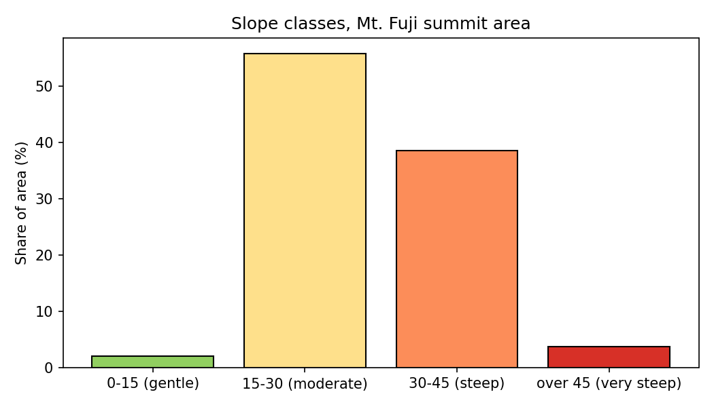
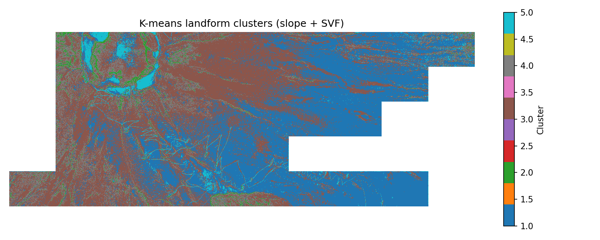

# Mt. Fuji LiDAR Terrain Analysis

Terrain analysis of Mt. Fuji's summit area using open airborne LiDAR data, combining QGIS processing with Python statistics and unsupervised machine learning.

## Data

- VIRTUAL SHIZUOKA ground LiDAR (2021), 38 tiles, about 4.6 km2 of valid terrain
- Downloaded from the public AWS bucket `s3://virtual-shizuoka/2021/LP/Ground/08/ME/35/`
- Coordinate system: EPSG:6676 (JGD2011 / Japan Plane Rectangular CS VIII)

Raw data is not included because of its size.

Data credit: VIRTUAL SHIZUOKA point cloud data (c) Shizuoka Prefecture, licensed under [CC BY 4.0](https://creativecommons.org/licenses/by/4.0/). Processed for this project.

## Workflow

**QGIS**
1. Assigned the coordinate system to all tiles
2. Combined the tiles into one virtual point cloud
3. Created a 0.5 m terrain model (DTM)
4. Made a hillshade, sky-view factor (SVF) and slope map

**Python** (`scripts/`)
5. `slope_stats.py`: area and share of each slope class
6. `landforms_kmeans.py`: unsupervised landform classification with K-means

## Results

| Hillshade | Sky-view factor |
|---|---|
|  |  |

### Slope

Green: gentle (0-15 degrees), yellow: 15-30, orange: 30-45, red: steep (over 45).

| Slope class | Share of area |
|---|---|
| 0-15 degrees (gentle) | 2.1% |
| 15-30 degrees (moderate) | 55.7% |
| 30-45 degrees (steep) | 38.5% |
| over 45 degrees (very steep) | 3.7% |

The mean slope is 29.8 degrees. Most of the area is 15-30 degrees, with a large share at 30-45 degrees. The steepest areas (over 45 degrees) are the crater walls and gully sides.

### Trails close-up

At 0.5 m resolution, the switchback climbing trails are clearly visible as flat paths on the steep slope.
Comparison with OpenStreetMap shows that the study area covers the upper Fujinomiya and Gotemba trails on the south-east side of the summit, together with supply roads between the mountain huts.

### Landform classification (K-means)

Pixels were grouped into 5 terrain types using unsupervised K-means clustering on two features: slope and sky-view factor. The features were standardised, and the model was trained on a random sample of 200,000 pixels, then applied to all 18.2 million valid pixels.

| Cluster | Mean slope | Mean SVF | Share | Interpretation |
|---|---|---|---|---|
| 5 | 12.4 deg | 0.886 | 3.1% | Flat / trails |
| 1 | 25.3 deg | 0.823 | 41.4% | Moderate open slopes |
| 3 | 31.3 deg | 0.780 | 41.8% | Steep cone slopes |
| 4 | 39.0 deg | 0.699 | 11.5% | Rough steep ground |
| 2 | 60.0 deg | 0.557 | 2.2% | Cliffs / crater walls |

Without being told what to look for, the algorithm separated cliffs (crater walls) from flat ground, and picked out the trails as part of the flat class. Steeper ground also tends to be more enclosed (lower SVF).

## Limitations

- Ground points only (no buildings or vegetation)
- Some gaps in coverage
- One survey date, so no change over time
- K-means clusters 1 and 3 are less distinct, because K-means also splits continuous slopes where there is no sharp natural boundary
- The classification is pixel-based, so the map shows some salt-and-pepper noise
- Cluster names are interpretations based on the statistics and visual checks, not ground truth

## Next steps

- Compare the K-means result with an established landform method (geomorphons, `r.geomorphon`)
- Add more features, such as curvature, and smooth the classification
- Pair with a second survey epoch for change detection
